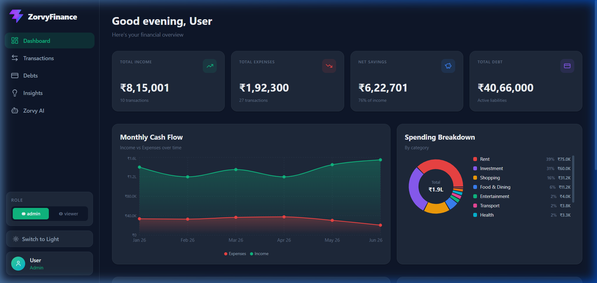

# ZorvyFinance 💎

ZorvyFinance is a premium, AI-powered personal finance dashboard designed to give you total control over your wealth. Track your income, manage expenses, monitor debts, and get personalized financial advice from **ZorvyAI**.



## ✨ Features

- **📊 Intelligent Dashboard**: A high-fidelity overview of your total income, expenses, net savings, and outstanding debts.
- **🔔 Smart Notifications**: Proactive alerts for upcoming **Debt EMIs** and large expense detection (₹50k+).
- **🤖 ZorvyAI**: A dedicated financial assistant page powered by **Google Gemini**. Get personalized advice and debt strategies.
- **📱 Mobile Bottom Nav**: Optimized mobile navigation bar with one-tap access to primary financial views.
- **✨ Animated Counters**: Premium "wow" factor with numbers that count up from zero on load.
- **📈 Debt & Loan Tracking**: Visual progress bars and automated payment recording for all liabilities.
- **💸 Transaction Management**: Clean, searchable list with category-based filtering and CSV export.
- **🛡️ Production Ready**: Features a global Error Boundary, zero-error production builds, and A11y optimizations.

## 🛠️ Tech Stack

- **React 18** (UI Library)
- **Vite** (Build Tool)
- **Lucide React** (Iconography)
- **Recharts** (Data Visualization)
- **Gemini Pro API** (AI Intelligence)
- **Vanilla CSS** (Custom Premium Styling)

## 🚀 Getting Started

### Prerequisites

- Node.js (v18+)
- A **Gemini API Key** from [Google AI Studio](https://aistudio.google.com/)

### Installation

1. **Clone the repository**
   ```bash
   git clone https://github.com/muhammadnavas/zorvy-finance.git
   cd zorvy-finance
   ```

2. **Install dependencies**
   ```bash
   npm install
   ```

3. **Configure Environment Variables**
   Create a `.env` file in the root directory:
   ```env
   VITE_GEMINI_API_KEY=your_gemini_api_key_here
   ```

4. **Run in Development**
   ```bash
   npm run dev
   ```
   Visit `http://localhost:5173` to view the app!

## 📦 Project Structure

```text
src/
├── components/       # UI Components (Dashboard, BottomBar, NotificationCenter, etc.)
├── context/          # FinanceContext for Global Smart Alerts & State
├── services/         # AI API integration (Gemini)
├── assets/           # Global styles and static files
└── App.jsx           # Responsive Layout & Content Wrapper
```

## 📜 Available Scripts

- `npm run dev`: Start development server.
- `npm run build`: Create an optimized production bundle.
- `npm run preview`: Preview the production build locally.
- `npm run lint`: Run ESLint for code quality checks.

## 🤝 Contributing

Contributions are welcome! If you'd like to improve ZorvyFinance, please fork the repo and create a pull request.

## 📄 License

This project is licensed under the MIT License.

## 👤 Author

**Muhammad Navas**
- [GitHub](https://github.com/muhammadnavas)
- [Project Repository](https://github.com/muhammadnavas/zorvy-finance)

---
*Built with ❤️ for better financial freedom.*
